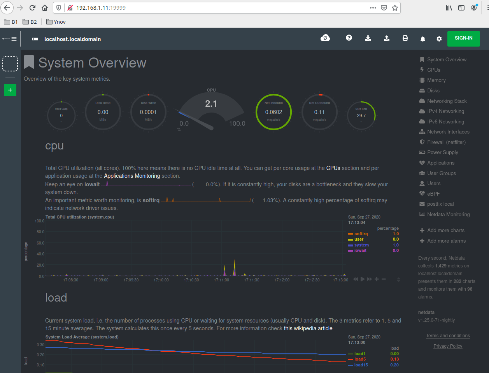

# 0. Prérequis
## Partitionnement
```
pvcreate /dev/sdb
vgcreate data /dev/sdb
lvcreate -L 2G data -n SRV
lvcreate -L 2.5G data -n HOME
mkfs -t ext4 /dev/data/SRV
mkfs -t ext4 /dev/data/HOME
mkdir /srv/data1
mkdir /srv/data2
mount /dev/data/SRV /srv/data1
mount /dev/data/HOME /srv/data2
```
```
[root@localhost ~]# cat /etc/fstab 
[...]
/dev/data/SRV /srv/data1 ext4 defaults 0 0
/dev/data/HOME /srv/data2 ext4 defaults 0 0

[root@localhost ~]# lvs
[...]                                                  
  HOME data   -wi-ao----  2.50g                                                    
  SRV  data   -wi-ao----  2.00g

[root@localhost ~]# mount -av
[...]
/srv/data1               : already mounted
/srv/data2               : already mounted
```

## Internet
```
[root@localhost ~]# ip a
[...]
2: enp0s3: <BROADCAST,MULTICAST,UP,LOWER_UP> mtu 1500 qdisc pfifo_fast state UP group default qlen 1000
    link/ether 08:00:27:4b:8f:05 brd ff:ff:ff:ff:ff:ff
    inet 10.0.2.15/24 brd 10.0.2.255 scope global noprefixroute dynamic enp0s3
       valid_lft 85453sec preferred_lft 85453sec
    inet6 fe80::a00:27ff:fe4b:8f05/64 scope link 
       valid_lft forever preferred_lft forever
[...]

[root@localhost ~]# ip r s
default via 10.0.2.2 dev enp0s3 proto dhcp metric 100 
[...]
```

## Réseau local
```
[root@localhost ~]# ping -c 2 192.168.1.12
PING 192.168.1.12 (192.168.1.12) 56(84) bytes of data.
64 bytes from 192.168.1.12: icmp_seq=1 ttl=64 time=0.905 ms
64 bytes from 192.168.1.12: icmp_seq=2 ttl=64 time=1.00 ms

--- 192.168.1.12 ping statistics ---
2 packets transmitted, 2 received, 0% packet loss, time 1001ms
rtt min/avg/max/mdev = 0.905/0.955/1.005/0.050 ms

[root@localhost ~]# ip a
[...]
3: enp0s8: <BROADCAST,MULTICAST,UP,LOWER_UP> mtu 1500 qdisc pfifo_fast state UP group default qlen 1000
    link/ether 08:00:27:a5:63:90 brd ff:ff:ff:ff:ff:ff
    inet 192.168.1.11/24 brd 192.168.1.255 scope global noprefixroute enp0s8
       valid_lft forever preferred_lft forever
    inet6 fe80::a00:27ff:fea5:6390/64 scope link 
       valid_lft forever preferred_lft forever

[root@localhost ~]# ip r s
[...]
192.168.1.0/24 dev enp0s8 proto kernel scope link src 192.168.1.11 metric 101
```

## Hostname
```
[root@localhost ~]# hostname node1

[root@localhost ~]# echo "192.168.1.12 node2" >> /ect/hosts

[root@localhost ~]# ping -c 2 node2
PING node2 (192.168.1.12) 56(84) bytes of data.
64 bytes from node2 (192.168.1.12): icmp_seq=1 ttl=64 time=0.960 ms
64 bytes from node2 (192.168.1.12): icmp_seq=2 ttl=64 time=1.00 ms

--- node2 ping statistics ---
2 packets transmitted, 2 received, 0% packet loss, time 1002ms
rtt min/avg/max/mdev = 0.960/0.982/1.004/0.022 ms
```

## Utilisateur
```
[root@localhost ~]# useradd joris
```
Taper visudo puis mettre "%joris ALL=(ALL) ALL".

## SSH
```
[joris@manjaro-dell ~]$ ssh-keygen -f TP1
[joris@manjaro-dell .ssh]$ ssh-copy-id -i TP1 root@192.168.1.11
[joris@manjaro-dell .ssh]$ ssh-copy-id -i TP1 root@192.168.1.12
```

## Pare-feu
```
[root@localhost ~]# firewall-cmd --add-port=22/tcp --permanent
[root@localhost ~]# firewall-cmd --reload
[root@localhost ~]# systemctl start firewalld
```

# I. Setup serveur Web
## Installation
```
[root@localhost ~]# yum install epel-release
[root@localhost ~]# yum install nginx
```

## Configuration
- On creé un fichier /srv/site1/index.html et un fichier /srv/site2/index.html. Les dossier ont comme permission 100 et les fichier 400. Le tout appartient a l'utilisateur webserver.
```
[root@localhost srv]# chmod 100 site1 site2
[root@localhost srv]# chmod 400 site1/index.html site2/index.html
[root@localhost srv]# chown -R webserver:webserver site1 site2

[root@localhost srv]# ls -al
[...]
d--x------.  2 webserver webserver   24 Sep 23 17:57 site1
d--x------.  2 webserver webserver   24 Sep 23 17:58 site2

[root@localhost srv]# ls -al site1
[...]
-r--------. 1 webserver webserver 19 Sep 23 17:57 index.html
```

- On ajoute au fichier nginx.conf la mention `user webserver;`. Ensuite on crée les configurations pour les différents sites. On appelle le premier site 'localhost.site1' et le deuxième 'localhost.site2'. On donc à /etc/hosts ces noms à la ligne 127.0.0.1. Il faut aussi créer le certificat et la clé SSL.
```
[root@localhost srv]# cat /etc/hosts
127.0.0.1   localhost localhost.localdomain localhost4 localhost4.localdomain4 localhost.site1 localhost.site2
[...]

[root@localhost srv]# openssl req -x509 -out localhost.crt -keyout localhost.key   -newkey rsa:2048 -nodes -sha256   -subj '/CN=localhost' -extensions EXT -config <( \
   printf "[dn]\nCN=localhost\n[req]\ndistinguished_name = dn\n[EXT]\nsubjectAltName=DNS:localhost\nkeyUsage=digitalSignature\nextendedKeyUsage=serverAuth")

[root@localhost srv]# cat /etc/nginx/nginx.conf
user webserver;
worker_processes auto;
error_log /var/log/nginx/error.log;
pid /run/nginx.pid;

# Load dynamic modules. See /usr/share/doc/nginx/README.dynamic.
include /usr/share/nginx/modules/*.conf;

events {
    worker_connections 1024;
}

http {
     server {
        listen 80;
        listen [::]:80;
        root /srv/site1;
        index index.html index.htm;
        server_name localhost.site1;

        location / {
           root /srv/site1;
        }
     }
     
     server {
        listen 80;
        listen [::]:80;
        root /srv/site2;
        index index.html index.htm;
        server_name localhost.site2;

   location / {
       root /srv/site2;
   }
}


    server {
        listen       443 ssl http2 default_server;
        listen       [::]:443 ssl http2 default_server;
        server_name  localhost.site1;
        root         /srv/site1;

        ssl_certificate "/etc/pki/nginx/server.crt";
        ssl_certificate_key "/etc/pki/nginx/private/server.key";
        ssl_session_cache shared:SSL:1m;
        ssl_session_timeout  10m;
        ssl_ciphers HIGH:!aNULL:!MD5;
        ssl_prefer_server_ciphers on;

        # Load configuration files for the default server block.
        include /etc/nginx/default.d/*.conf;

        location / {
          root /srv/site1;
        }

        error_page 404 /404.html;
            location = /40x.html {
        }

        error_page 500 502 503 504 /50x.html;
            location = /50x.html {
        }
    }
    
    server {
        listen       443 ssl http2;
        listen       [::]:443 ssl http2;
        server_name  localhost.site2;
        root         /srv/site2;

        ssl_certificate "/etc/pki/nginx/server.crt";
        ssl_certificate_key "/etc/pki/nginx/private/server.key";
        ssl_session_cache shared:SSL:1m;
        ssl_session_timeout  10m;
        ssl_ciphers HIGH:!aNULL:!MD5;
        ssl_prefer_server_ciphers on;

        # Load configuration files for the default server block.
        include /etc/nginx/default.d/*.conf;

        location / {
          root /srv/site2;
        }

        error_page 404 /404.html;
            location = /40x.html {
        }

        error_page 500 502 503 504 /50x.html;
            location = /50x.html {
            }
    }

}

[root@localhost srv]# firewall-cmd --add-port=80/tcp --permanent
[root@localhost srv]# firewall-cmd --add-port=443/tcp --permanent
[root@localhost srv]# firewall-cmd --reload
[root@localhost srv]# systemctl restart firewalldl
```

 ## Tests
 - Voici le résultat sur la machine node2
 ```
[root@localhost ~]# curl localhost.site1
CECI EST LE SITE 1
[root@localhost ~]# curl localhost.site2
CECI EST LE SITE 2
[root@localhost ~]# curl -k https://localhost.site2
CECI EST LE SITE 2
[root@localhost ~]# curl -k https://localhost.site1
CECI EST LE SITE 1
 ```

# II. Script de sauvegarde
## Script
Ce script doit être exécuter par l'utilisateur backup qui appartient au groupe webserver. Les dossiers site ont maintenant des droits 150 et les fichiers index.html ont comme droits 440. Le script a lui les droits 100.
```
#!/bin/sh

# utilisation : ./tp1_backup.sh /srv/site1

sauvegarde()
{
    # "site${1: -1}_$(date "+%Y%m%d_%H%M")"
    tar -czvf site${1: -1}_$(date "+%Y%m%d_%H%M").tar.gz $1
}

suppression()
{
    if test $(ls | grep site${1: -1} | wc -w) -gt 7
    then
         ls | grep site${1: -1} | sort > tmp
         rm -rf $(head -1 tmp)
         rm -f tmp
    fi
}

sauvegarde $1
suppression $1
```

## Crontab
```
[backup@localhost ~]$ crontab -l
01 * * * * ./tp1_backup.sh /srv/site1
01 * * * * ./tp1_backup.sh /srv/site2
```

## Restauration
```
[root@localhost backup]# tar -xf site1_20200924_1234.tar.gz
[root@localhost backup]# mv srv/site1/ /srv/site1
```

## Ajout à systemd
```
[root@localhost backup]# cat /etc/systemd/system/backup.service 
[Unit]
Description=Backup des sites 1 et 2
After=network.target
 
[Service]
Type=simple 
ExecStart=/home/backup/tp1_backup.sh /srv/site1
RemainAfterExit=no

[root@localhost backup]# systemctl start backup
[root@localhost backup]# ls
site1_20200924_1234.tar.gz  site1_20200924_1847.tar.gz  site2_20200924_1601.tar.gz
site1_20200924_1601.tar.gz  site1_20200924_1849.tar.gz  tp1_backup.sh
[root@localhost backup]# date
Thu Sep 24 18:49:23 CEST 2020
```

# III. Monitoring, alerting
## Installation et test
* Installation 
`bash <(curl -Ss https://my-netdata.io/kickstart.sh)`
* test 
`firewall-cmd --add-port=19999/tcp --permanent`
`firewall-cmd --reload`


## Alerte discord
- Creation d'un serveur discord et intégration d'un webhook
- Ajout du lien du webhook dans /etc/netdata/health_alarm_notify.conf