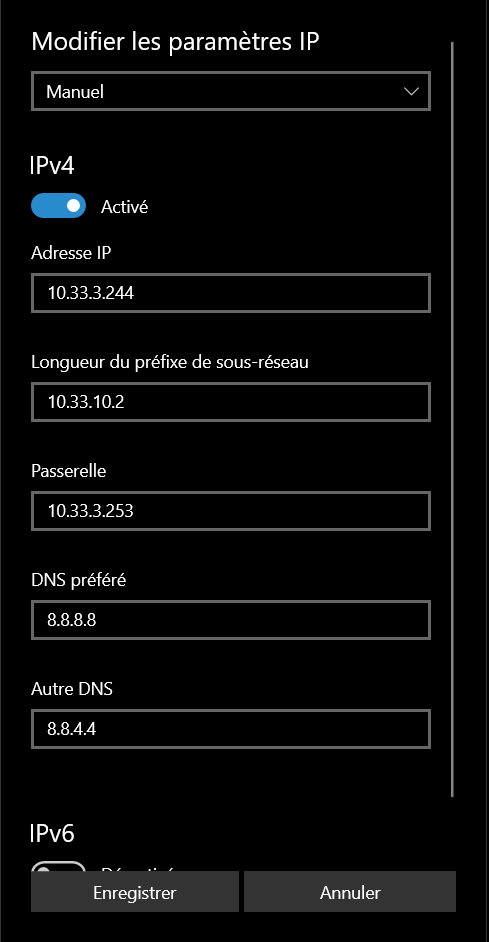
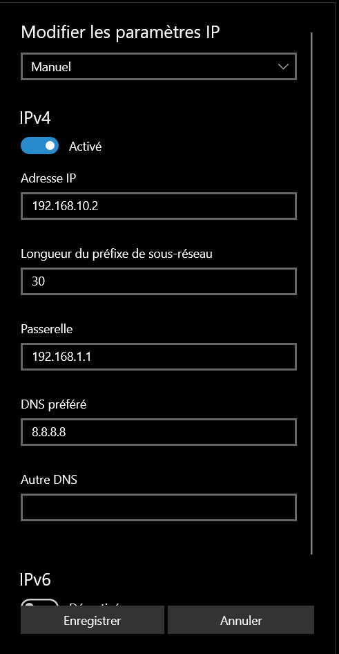
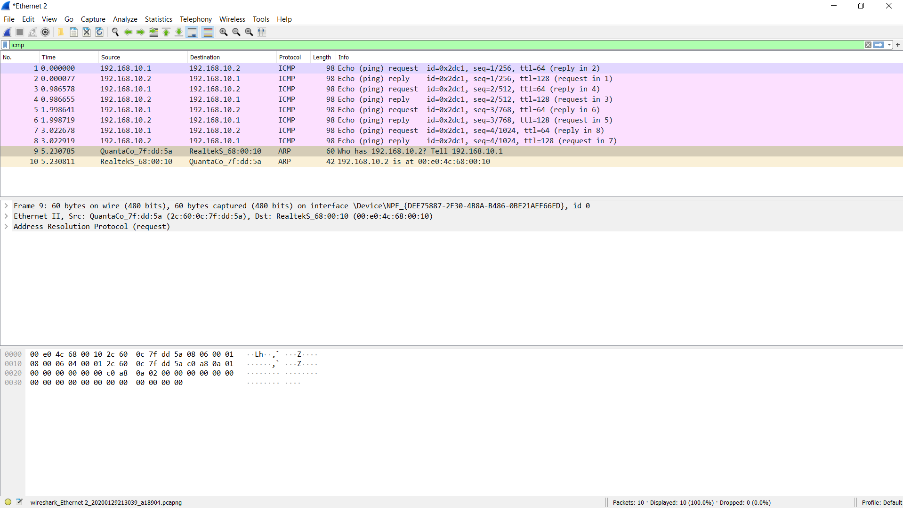
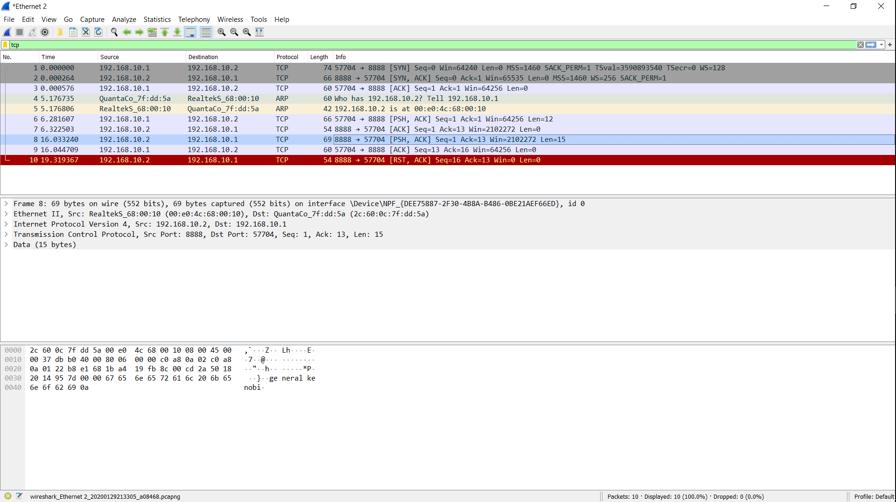

# RENDU DU TP1

  

  

# I. Exploration en solo

  

  

## 1. Affichage d'informations sur la pile TCP/IP locale

  

  

***Les infos des cartes réseaux du PC***

  

  

*Interface wifi*

  

  

`ipconfig /all`

```

Carte réseau sans fil Wi-Fi :

  
  

Suffixe DNS propre à la connexion. . . : auvence.co

Description. . . . . . . . . . . . . . : Intel(R) Wireless-AC 9560 160MHz

Adresse physique . . . . . . . . . . . : 40-74-E0-D4-93-8D

DHCP activé. . . . . . . . . . . . . . : Oui

Configuration automatique activée. . . : Oui

Adresse IPv6 de liaison locale. . . . .: fe80::d0f4:578a:42e2:2e3f%19(préféré)

Adresse IPv4. . . . . . . . . . . . . .: 10.33.2.162(préféré)

Masque de sous-réseau. . . . . . . . . : 255.255.252.0

Bail obtenu. . . . . . . . . . . . . . : Thursday, January 16, 2020 12:04:32 PM

Bail expirant. . . . . . . . . . . . . : Thursday, January 16, 2020 1:04:31 PM

Passerelle par défaut. . . . . . . . . : 10.33.3.253

Serveur DHCP . . . . . . . . . . . . . : 10.33.3.254

IAID DHCPv6 . . . . . . . . . . . : 171996384

DUID de client DHCPv6. . . . . . . . : 00-01-00-01-24-F7-CE-CF-9C-EB-E8-B3-9F-24

Serveurs DNS. . . . . . . . . . . . . : 10.33.10.20

10.33.10.2

8.8.8.8

8.8.4.4

NetBIOS sur Tcpip. . . . . . . . . . . : Activé

```

  

  

  

- nom : Intel(R) Wireless-AC 9560 160MHz

  

  

- adresse MAC : 40-74-E0-D4-93-8D

  

  

- adresse IP : 10.33.2.162

  

  

  

*Interface ethernet*

  

  

*Carte ethernet inexistante*

  

  

  

***La gateway***

`netstat -nr`

```

.

.

.

IPv4 Table de routage

===========================================================================

Itinéraires actifs :

Destination réseau Masque réseau Adr. passerelle Adr. interface Métrique

0.0.0.0 0.0.0.0 10.33.3.253 10.33.3.243 35

10.33.0.0 255.255.252.0 On-link 10.33.3.243 291

10.33.3.243 255.255.255.255 On-link 10.33.3.243 291

10.33.3.255 255.255.255.255 On-link 10.33.3.243 291

127.0.0.0 255.0.0.0 On-link 127.0.0.1 331

127.0.0.1 255.255.255.255 On-link 127.0.0.1 331

127.255.255.255 255.255.255.255 On-link 127.0.0.1 331

192.168.56.0 255.255.255.0 On-link 192.168.56.1 281

192.168.56.1 255.255.255.255 On-link 192.168.56.1 281

192.168.56.255 255.255.255.255 On-link 192.168.56.1 281

224.0.0.0 240.0.0.0 On-link 127.0.0.1 331

224.0.0.0 240.0.0.0 On-link 192.168.56.1 281

224.0.0.0 240.0.0.0 On-link 10.33.3.243 291

255.255.255.255 255.255.255.255 On-link 127.0.0.1 331

255.255.255.255 255.255.255.255 On-link 192.168.56.1 281

255.255.255.255 255.255.255.255 On-link 10.33.3.243 291

===========================================================================

Itinéraires persistants :

Aucun

.

.

.

```

La passerelle par défaut est `10.33.3.253`

  

***L'utilité de la gateway***

  

La gateway est l'adresse IP à joindre pour envoyer un message sur un autre réseau. Ici, c'est le routeur d'Ynov.

  
  

## 2. Modifications des informations

  

  

### A. Modification d'adresse IP (part 1)

  

  

***Avec l'interface graphique***

  

  

Sous Windows 10 : Panneau de configuration > Réseau et internet > Etat > Modifier les propriétés de connexion > Modifier > Manuel > IPv4

  

  



  

  

`ipconfig /all`

```

Carte réseau sans fil Wi-Fi :

.

.

.

Adresse IPv4. . . . . . . . . . . . . .: 10.33.3.244(préféré)

Masque de sous-réseau. . . . . . . . . : 255.192.0.0

Passerelle par défaut. . . . . . . . . : 10.33.3.253

```

  

  

  

### C. Modification d'adresse IP (part 2)

Commande nmap et son résultat :

`nmap -sn -PE 10.33.0.0/22`
```

Nmap scan report for 10.33.3.229

Host is up (0.11s latency).

  

Nmap scan report for 10.33.3.236

Host is up (1.1s latency).

  

Nmap scan report for 10.33.3.253

Host is up (0.0053s latency).

```

On peut voir par exemple que les adresses entre *10.33.3.230* et *10.33.3.235* sont libres

  

  

  

# II. Exploration locale en duo (Windows 10 et Ubuntu)


## 3. Modification d'adresse IP

***Modification de l'adresse IP***



***Vérification des modifications***
`ipconfig /all`
```
Carte Ethernet Ethernet 2 :

   Suffixe DNS propre à la connexion. . . :
   Description. . . . . . . . . . . . . . : Realtek USB GbE Family Controller #2
   Adresse physique . . . . . . . . . . . : 00-E0-4C-68-00-10
   DHCP activé. . . . . . . . . . . . . . : Non
   Configuration automatique activée. . . : Oui
   Adresse IPv6 de liaison locale. . . . .: fe80::6576:5ee6:4183:8b2a%19(préféré)
   Adresse IPv4. . . . . . . . . . . . . .: 192.168.10.2(préféré)
   Masque de sous-réseau. . . . . . . . . : 255.255.255.252
   Passerelle par défaut. . . . . . . . . : 192.168.1.1
   IAID DHCPv6 . . . . . . . . . . . : 784078063
   DUID de client DHCPv6. . . . . . . . : 00-01-00-01-24-F7-CE-CF-9C-EB-E8-B3-9F-24
   Serveurs DNS. . .  . . . . . . . . . . : 8.8.8.8
   NetBIOS sur Tcpip. . . . . . . . . . . : Activé
```

***Teste de la connectivité avec un ping***
`ping 192.168.10.1`
```
Envoi d’une requête 'Ping'  192.168.10.1 avec 32 octets de données :
Réponse de 192.168.10.1 : octets=32 temps=11 ms TTL=64
Réponse de 192.168.10.1 : octets=32 temps<1ms TTL=64
Réponse de 192.168.10.1 : octets=32 temps=1 ms TTL=64
Réponse de 192.168.10.1 : octets=32 temps<1ms TTL=64

Statistiques Ping pour 192.168.10.1:
    Paquets : envoyés = 4, reçus = 4, perdus = 0 (perte 0%),
Durée approximative des boucles en millisecondes :
    Minimum = 0ms, Maximum = 11ms, Moyenne = 3ms
```

## 4. Utilisation d'un des deux comme gateway
***Je n'ai pas réussi à réaliser cette partie***

## 5. Petit chat privé

***Sur le PC serveur***
`nc.exe -l -p 8888`
```
Hello there
General Kenobi
```
***Sur le PC client***
`nc 192.168.10.2 8888`
```
Hello there
General Kenobi
```
***Pour aller plus loin***
Le PC serveur n'écoute que la machine *192.168.10.1 : *`nc.exe -l -p 9999 192.168.10.1`


## 6. Wireshark
***PING***


***NETCAT***



## 7. Firewall
***Autoriser les pings***
*Pare-feu avec fonctions avancées de sécurité* => *règles de trafic entrant* => *nouvelle règle* => *personnaliser* => *ICMPv4* => *choisir un nom*

***Autoriser netcat***
*Pare-feu avec fonctions avancées de sécurité* => *règles de trafic entrant* => *nouvelle règle* => *port* => *TCP / 8888* => *choisir un nom*


# III. Manipulation d'autre outils/protocoles côté client

## DHCP

***Adresse IP du serveur DHCP du réseau Wifi YNOV***

`ipconfig /all` :

```

Carte réseau sans fil Wi-Fi :

.

.

.

Serveur DHCP . . . . . . . . . . . . . : 10.33.51.254

```

  

***Bail DHCP***

`ipconfig /all` :

```

Carte réseau sans fil Wi-Fi :

.

.

.

Bail expirant. . . . . . . . . . . . . : Thursday, January 30, 2020 9:00:36 AM

```

  

***Demande d'une nouvelle adresse***

Libération de la configuration DHCP : `ipconfig /release`

Renouvellement de la configuration DHCP : `ipconfig /renew`

`ipconfig /all` :

```

Carte réseau sans fil Wi-Fi :

.

.

.

Bail expirant. . . . . . . . . . . . . : Thursday, January 30, 2020 9:30:13 AM

```

  

## DNS

***Adresse IP du serveur DNS***

`ipconfig /all` :

```

Carte réseau sans fil Wi-Fi :

.

.

.

Serveurs DNS. . . . . . . . . . . . . : 10.33.10.20

10.33.10.2

8.8.8.8

```

  

***Utilisation de nslookup***

- google.com

`nslookup google.com`

```

Serveur : UnKnown

Address: 10.33.10.20

  

Réponse ne faisant pas autorité :

Nom : google.com

Addresses: 2a00:1450:4007:808::200e

216.58.201.238

```

- ynov.com

`nslookup ynov.com`

```

Serveur : UnKnown

Address: 10.33.10.20

  

Réponse ne faisant pas autorité :

Nom : ynov.com

Address: 217.70.184.38

```

- Interprétation

Le serveur DNS que connait mon ordinateur (10.33.10.20) ne connait pas l'adresse IP de google.com et de ynov.com, mais un serveur DNS que mon ordinateur ne connait pas à donner les adresses 216.58.201.238 et 217.70.184.38 en réponse.

  

***Utilisation de reverse lookup***

- 78.74.21.21

`nslookup 78.74.21.21`

```

Serveur : UnKnown

Address: 10.33.10.20

  

Nom : host-78-74-21-21.homerun.telia.com

Address: 78.74.21.21

```

- 92.146.54.88

`nslookup 92.146.54.88`

```

Serveur : UnKnown

Address: 10.33.10.20

  

Nom : apoitiers-654-1-167-88.w92-146.abo.wanadoo.fr

Address: 92.146.54.88

```

- Interprétation

Ici, c'est le serveur DNS 10.33.10.20 qui a répondu.

78.74.21.21 <=> host-78-74-21-21.homerun.telia.com

92.146.54.88 <=> apoitiers-654-1-167-88.w92-146.abo.wanadoo.fr