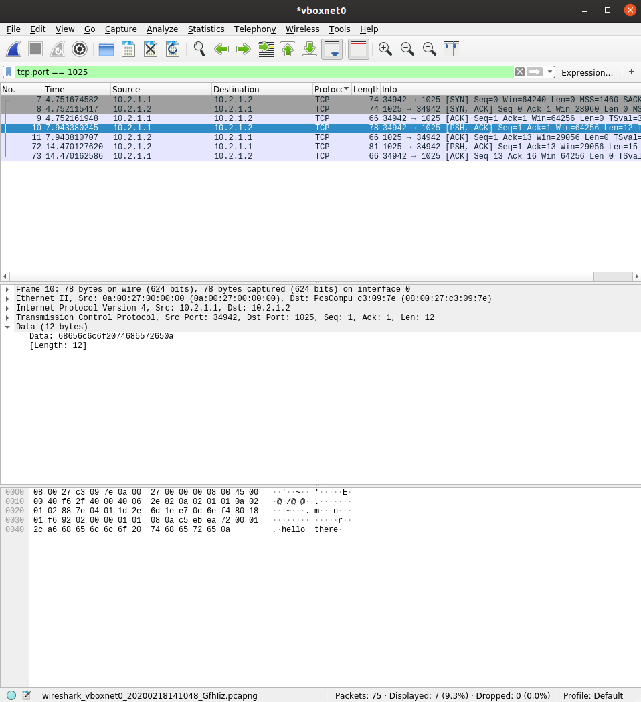

# TP2
# Création et utilisation simples d'une VM CentOS

## 4. Configuration réseau d'une machine CentOS

***Tableau de mes cartes réseaux***

|Name|IP|MAC|Fonction|
|--------|----|--------|-----|
|enp0s3|10.0.2.15/24|08:00:27:27:ea:3a|Carte NAT (accès internet)|
|enp0s8|10.2.1.2/24|08:00:27:c7:55:10|Réseau Host-only|

***Changement de la configuration***

- Changement de l'IP statique :
`sudo ifdown enp0s8` > `cd /etc/sysconfig/network-scripts/` > `sudo nano ifcfg-enp0s8` > `IPADDR=10.2.1.3` > `sudo ifup enp0s8`
Nouvelle IP : *10.2.1.2/24*

- Ping du PC hôte vers le réseau Host-Only : 
`ping 10.2.1.3`
```
PING 10.2.1.3 (10.2.1.3) 56(84) bytes of data.
64 bytes from 10.2.1.3: icmp_seq=1 ttl=64 time=0.409 ms
64 bytes from 10.2.1.3: icmp_seq=2 ttl=64 time=0.468 ms
64 bytes from 10.2.1.3: icmp_seq=3 ttl=64 time=0.429 ms
^C
--- 10.2.1.3 ping statistics ---
3 packets transmitted, 3 received, 0% packet loss, time 2047ms
rtt min/avg/max/mdev = 0.409/0.435/0.468/0.024 ms
```

## 5. Appréhension de quelques commandes

***nmap***
`nmap -sP 10.2.1.0/24`
```
Starting Nmap 7.80 ( https://nmap.org ) at 2020-02-13 10:45 CET
Nmap scan report for 10.2.1.3
Host is up (0.00035s latency).
MAC Address: 08:00:27:C7:55:10 (Oracle VirtualBox virtual NIC)
Nmap scan report for dd-ubuntu (10.2.1.1)
Host is up.
Nmap done: 256 IP addresses (2 hosts up) scanned in 2.07 seconds
```
- Adresse IP de la VM : *10.2.1.3*
- Adresse IP de la machine hôte : *10.2.1.1*
- Cette adresse est celle de la carte enp0s8 (voir le tableau plus)

***ss***
`ss -ltunp`
```
Netid  State      Recv-Q Send-Q Local Address:Port               Peer Address:Port              
udp    UNCONN     0      0         *:68                    *:*                  
tcp    LISTEN     0      100    127.0.0.1:25                    *:*                  
tcp    LISTEN     0      128       *:22                    *:*                  
tcp    LISTEN     0      100       [::1]:25                 [::]:*                  
tcp    LISTEN     0      128    [::]:22                 [::]:*  
```

# II. Notion de ports
## 1. SSH
- Adresse du serveur ssh : `echo $SSH_CONNECTION | awk '{print "Le serveur tourne sur l'\''adresse " $3 " et sur le port " $4}'` => `Le serveur tourne sur l'adresse 10.2.1.3 et sur le port 22`

- Connexion : 
`ssh 10.2.1.3`
`ss -ltunp | grep 22`
```
tcp    LISTEN     0      128       *:22                    *:*                  
tcp    LISTEN     0      128    [::]:22                 [::]:*
```

## 2. Firewall
### A. SSH
- Modification du port :
`vim /etc/ssh/sshd_config` > *Port 1024*

- Tentative de connexion :
`ss -ltunp | grep 1024` : 
```
tcp    LISTEN     0      128       *:1024                  *:*                  
tcp    LISTEN     0      128    [::]:1024               [::]:*
```
`ssh 10.2.1.3 -p 1024` :  `ssh: connect to host 10.2.1.3 port 1024: No route to host`

- Firewall
`sudo firewall-cmd --add-port=1024/tcp --permanent`
`sudo firewall-cmd --reload`

### B. Netcat
- La VM est le serveur :
`sudo firewall-cmd --add-port=1025/tcp --permanent`
`sudo firewall-cmd --reload`
`nc -l 1025`
Sur l'hôte : `nc 10.2.1.3 1025`

- L'hôte est le serveur
Sur l'hôte : `nc -l -p 1025`
Sur la VM : `nc 10.2.1.1 1025`

### 3. Wireshark

- On peut voir dans la case la plus basse que le message est "hello there"
- Les trois messages de connexions sont : SYN / SYN,ACK / ACK. SYN correspond à une demande de synchronisation et ACK à un accusé de recpetion.

# III. Routage statique
## 2. Configuration du routage
### A. PC1
- Commande pour ajouter une passerelle.
`sudo ip route add 10.2.2.0/24 via 10.2.12.2 dev enx00e04c680010`
- Résultat du ping :
```
ping 10.2.2.1
PING 10.2.2.1 (10.2.2.1) 56(84) bytes of data.
64 bytes from 10.2.2.1: icmp_seq=1 ttl=64 time=0.217 ms
64 bytes from 10.2.2.1: icmp_seq=2 ttl=64 time=0.381 ms
```

### B. PC2
- Commande pour ajouter une passerelle.
`sudo ip route add 10.2.1.0/24 via 10.2.12.1 dev enp8s0`
- Résultat du ping :
```
ping 10.2.1.1
PING 10.2.1.1 (10.2.1.1) 56(84) bytes of data.
64 bytes from 10.2.1.1: icmp_seq=1 ttl=64 time=0.704 ms
64 bytes from 10.2.1.1: icmp_seq=2 ttl=64 time=0.491 ms
```

### C. VM1
- Commande pour ajouter une passerelle.
`sudo ip route add 10.2.2.0/24 via 10.2.1.1 dev enp8s0`
- Résultat du ping :
```
ping 10.2.2.1
PING 10.2.2.1 (10.2.2.1) 56(84) bytes of data.
64 bytes from 10.2.2.1: icmp_seq=1 ttl=63 time=0.631 ms
64 bytes from 10.2.2.1: icmp_seq=2 ttl=63 time=0.478 ms
```
- Résultat du traceroute:
```
traceroute 10.2.2.1
 1  10.2.1.1 (10.2.1.1)  0.126 ms  0.088 ms  0.029 ms
 2  10.2.2.1 (10.2.2.1)  0.241 ms  0.198 ms  0.132 ms
```

### D. VM2
- Commande pour ajouter une passerelle.
`sudo ip route add 10.2.1.0/24 via 10.2.2.1 dev enp8s0`
- Résultat du ping :
```
ping 10.2.1.1
PING 10.2.1.1 (10.2.1.1) 56(84) bytes of data.
64 bytes from 10.2.1.1: icmp_seq=1 ttl=63 time=0.584 ms
64 bytes from 10.2.1.1: icmp_seq=2 ttl=63 time=1.03 ms
```
- Résultat du traceroute:
```
traceroute 10.2.1.1
 1  10.2.2.1 (10.2.2.1)  0.136 ms  0.094 ms  0.030 ms
 2  10.2.1.1 (10.2.1.1)  0.244 ms  0.189 ms  0.141 ms
```

### E. El gran final
```
ping 10.2.2.2
PING 10.2.2.2 (10.2.2.2) 56(84) bytes of data.
64 bytes from 10.2.2.2: icmp_seq=1 ttl=62 time=1.09 ms
64 bytes from 10.2.2.2: icmp_seq=2 ttl=62 time=1.14 ms
```

```
ping 10.2.1.2
PING 10.2.1.2 (10.2.1.2) 56(84) bytes of data.
64 bytes from 10.2.1.2: icmp_seq=1 ttl=62 time=1.23 ms
64 bytes from 10.2.1.2: icmp_seq=2 ttl=62 time=1.33 ms
```

## 3. Configuration des noms de domaine
- ping :
```
ping vm2
PING vm2 (10.2.2.2) 56(84) bytes of data.
64 bytes from vm2 (10.2.2.2): icmp_seq=1 ttl=62 time=0.657 ms
64 bytes from vm2 (10.2.2.2): icmp_seq=2 ttl=62 time=1.41 ms
```
- traceroute :
```
traceroute vm2
traceroute to vm2 (10.2.2.2), 30 hops max, 60 byte packets
 1  10.2.1.1 (10.2.1.1)  0.128 ms  0.102 ms  0.099 ms
 2  * * *
 3  vm2 (10.2.2.2)  0.787 ms !X  0.857 ms !X  0.775 ms !X
```
- netcat
VM1 : `nc -l -p 1025`
VM2 : `nc vm1 1025`