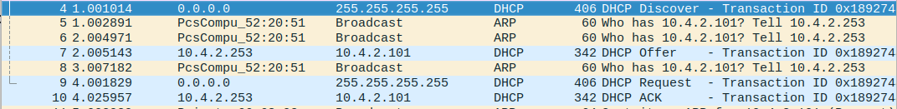

# I. Topologie 1 : simple
## 2. Mise en place
### B. Définition d'IPs statiques
* admin1
- IP :
NAME=enp0s3
DEVICE=enp0s3

BOOTPROTO=static
ONBOOT=yes

IPADDR=10.4.1.11
NETMASK=255.255.255.0

- nom d'hôte
ajout de admin1 dans hostname et /etc/hosts

* router1
```
conf t
interface FastEthernet0/0
ip adress 10.4.1.254 255.255.255.0
no shut
exit
interface FastEthernet1/0
ip adress 10.4.2.254 255.255.255.0
no shut
exit
```

```
Interface                  IP-Address      OK? Method Status                Protocol
FastEthernet0/0            10.4.1.254      YES manual up                    up      
FastEthernet1/0            10.4.2.254      YES manual up                    up 
```
`hostname router1`

* guest1
`ip 10.4.2.11 255.255.255.0`
`set pcname guest1`

* Vérification
- guest1 => router1
```
guest1> ping 10.4.2.254
84 bytes from 10.4.2.254 icmp_seq=1 ttl=255 time=9.581 ms
84 bytes from 10.4.2.254 icmp_seq=2 ttl=255 time=24.323 ms
84 bytes from 10.4.2.254 icmp_seq=3 ttl=255 time=26.899 ms
^C
```

- admin1 => router1
```
[joris@localhost ~]$ ping 10.4.1.254
PING 10.4.1.254 (10.4.1.254) 56(84) bytes of data.
64 bytes from 10.4.1.254: icmp_seq=1 ttl=255 time=25.9 ms
64 bytes from 10.4.1.254: icmp_seq=2 ttl=255 time=23.8 ms
--- 10.4.1.254 ping statistics ---
2 packets transmitted, 2 received, 0% packet loss, time 1000ms
rtt min/avg/max/mdev = 10.333/11.337/12.342/1.010 ms
```

- router1 => guest1
```
router1#ping 10.4.2.11
Type escape sequence to abort.
Sending 5, 100-byte ICMP Echos to 10.4.2.11, timeout is 2 seconds:
!!!!!
Success rate is 100 percent (5/5), round-trip min/avg/max = 16/27/36 ms
```

- router1 => admin1
```
router1#ping 10.4.1.11
Type escape sequence to abort.
Sending 5, 100-byte ICMP Echos to 10.4.1.11, timeout is 2 seconds:
!!!!!
Success rate is 100 percent (5/5), round-trip min/avg/max = 32/41/48 ms
```

- table arp
```
router1#show arp
Protocol  Address          Age (min)  Hardware Addr   Type   Interface
Internet  10.4.1.11               0   0800.274e.92bd  ARPA   FastEthernet0/0
Internet  10.4.2.11               7   0050.7966.6800  ARPA   FastEthernet1/0
Internet  10.4.1.254              -   cc01.0428.0000  ARPA   FastEthernet0/0
Internet  10.4.2.254              -   cc01.0428.0010  ARPA   FastEthernet1/0
```

MAC de admin1
```
[joris@localhost ~]$ ip a | grep link/ether
    link/ether 08:00:27:4e:92:bd brd ff:ff:ff:ff:ff:ff
```

### C. Routage
* admin1
`echo "10.4.2.0/24 via 10.4.1.254 dev enp0s3" >> /etc/sysconfig/network-scripts/route-enp0s3; sudo systemctl restart network`

* guest1
`guest1> ip 10.4.2.11 255.255.255.0 10.4.2.254`

* Vérification
- guest1 => admin1
```
guest1> ping 10.4.1.11
84 bytes from 10.4.1.11 icmp_seq=1 ttl=63 time=29.117 ms
84 bytes from 10.4.1.11 icmp_seq=2 ttl=63 time=19.259 ms
```

- admin1 => guest1
```
[joris@localhost ~]$ ping 10.4.2.11
PING 10.4.2.11 (10.4.2.11) 56(84) bytes of data.
64 bytes from 10.4.2.11: icmp_seq=1 ttl=63 time=3021 ms
64 bytes from 10.4.2.11: icmp_seq=2 ttl=63 time=2016 ms
--- 10.4.2.11 ping statistics ---
2 packets transmitted, 2 received, 0% packet loss, time 1000ms
rtt min/avg/max/mdev = 18.431/1518.535/3021.323/1118.911 ms, pipe 2
```

- Vérification du passage par le routeur
```
guest1> trace 10.4.1.11
trace to 10.4.1.11, 8 hops max, press Ctrl+C to stop
 1   10.4.2.254   9.262 ms  9.873 ms  9.460 ms
 2   *10.4.1.11   19.511 ms (ICMP type:3, code:10, Host administratively prohibited)
```

# II. Topologie 2 : dumb switches
## 2. Mise en place
### C. Vérification
- guest1 => admin1
```
guest1> ping 10.4.1.11
84 bytes from 10.4.1.11 icmp_seq=1 ttl=63 time=35.363 ms
84 bytes from 10.4.1.11 icmp_seq=2 ttl=63 time=20.302 ms
```

- admin1 => guest1
```
[joris@localhost ~]$ ping 10.4.2.11
PING 10.4.2.11 (10.4.2.11) 56(84) bytes of data.
64 bytes from 10.4.2.11: icmp_seq=1 ttl=63 time=15.2 ms
64 bytes from 10.4.2.11: icmp_seq=2 ttl=63 time=19.2 ms
--- 10.4.2.1 ping statistics ---
2 packets transmitted, 2 received, 0% packet loss, time 1000ms
rtt min/avg/max/mdev = 15.261/17.231/19.201/1.970 ms
```

- Vérification du passage par le routeur
```
guest1> trace 10.4.1.11
trace to 10.4.1.11, 8 hops max, press Ctrl+C to stop
 1   10.4.2.254   7.338 ms  10.376 ms  10.048 ms
 2   *10.4.1.11   19.263 ms (ICMP type:3, code:10, Host administratively prohibited)
```

# III. Topologie 3 : adding nodes and NAT
## 2. Mise en place
### B. VPCS
- guest2 :
`guest2> ip 10.4.2.12 255.255.255.0 10.4.2.254`

- guest3 :
`guest3> ip 10.4.2.13 255.255.255.0 10.4.2.254`

- Vérification
* guest2 => admin1
```
guest2> ping 10.4.1.11
84 bytes from 10.4.1.11 icmp_seq=1 ttl=63 time=14.939 ms
84 bytes from 10.4.1.11 icmp_seq=2 ttl=63 time=11.160 ms
```

* guest3 => admin1
```
guest3> ping 10.4.1.11
84 bytes from 10.4.1.11 icmp_seq=1 ttl=63 time=13.966 ms
84 bytes from 10.4.1.11 icmp_seq=2 ttl=63 time=11.336 ms
```

### C. Accès WAN
* Donner un accès WAN au routeur
```
conf t
interface FastEthernet2/0
ip address dhcp
no shut
exit
exit
```

```
conf t
interface FastEthernet2/0
ip nat outside
exit

interface FastEthernet1/0
ip nat inside
exit

interface FastEthernet0/0
ip nat inside
exit

access-list 1 permit any

ip nat inside source list 1 interface FastEthernet2/0 overload
```

* Configurer les clients
- DNS
admin1 : `echo "nameserver 1.1.1.1 > /etc/resolv.conf"`
guests : `ip dns 1.1.1.1`

* Vérification
- router1
```
R1#ping 1.1.1.1
Type escape sequence to abort.
Sending 5, 100-byte ICMP Echos to 1.1.1.1, timeout is 2 seconds:
!!!!!
Success rate is 100 percent (5/5), round-trip min/avg/max = 64/85/140 ms
```

- exemple avec guest1
```
guest1> ping www.google.com
www.google.com resolved to 216.58.201.228
84 bytes from 216.58.201.228 icmp_seq=1 ttl=59 time=28.019 ms
84 bytes from 216.58.201.228 icmp_seq=2 ttl=59 time=24.560 ms
```

# IV. Topologie 4 : home-made DHCP
## 2. Mise en place
### B. Setup de la VM
- Vérification du port
```
State      Recv-Q Send-Q Local Address:Port               Peer Address:Port              
UNCONN     0      0         *:67                    *:*                  
```
- Test du DHCP
```
guest3> ip dhcp
DORA IP 10.4.2.100/24 GW 10.4.2.254
```
